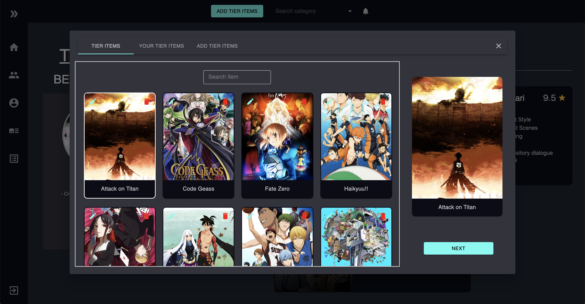
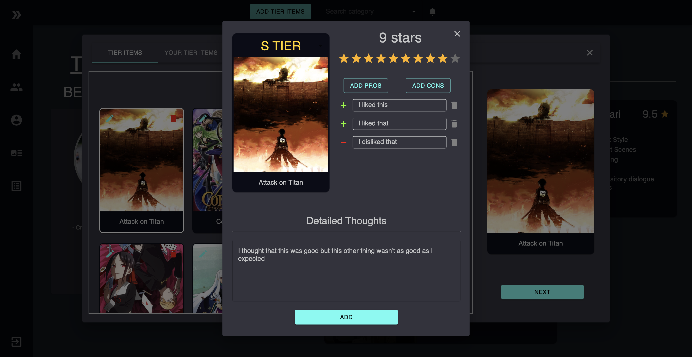

# Tier List Maker

Click on this link: [https://tierlist-57d59.web.app](https://tierlist-57d59.web.app)

## Deployment Instructions

For the frontend, build the application first and then deploy.

Ensure that the `axios.defaults.baseURL` in `App.js` is pointing to the prod URL
```
$ npm run build
$ firebase deploy
```

For the backend, run one of these commands (first one deploys all functions)

Ensure that the proper origins are allowed in `index.js`
```
$ firebase deploy

$ firebase deploy --only functions:api
```

## Main Feature
Whenever you create a Tier List, you must pick or create a category for it. After creating it, you'll be directed to the Tier List Page where you can add your items.

|  | 
|:--:| 
| *Add Tier Item Dialog* |

On this screen, you'll be shown all added Tier Items for the given category. You can switch to the 2nd tab which will display only Tier Items that you have added personally and you are allowed you to edit or delete only those who were created by you. The 3rd tab lets you upload an image to create a Tier Item for this category.

|  | 
|:--:| 
| *Edit Tier Item Dialog* |

Once you've selected your Tier Item, you can customize it by adding specific attributes such as Tier, Score, Pros, Cons and Detailed Thoughts. You can always change the attributes of your Tier Items after you've added it.

## Cors Error / Quota exceeded Error / Why are things not loading?
Since I'm using the free version of the Firebase Cloud Functions, it limits the number of API calls per 100 seconds. So, if you use the functionalities of the website really quickly (e.g. switching pages quickly, liking and unliking rapidly), it will stop the API call. There will be stuff that won't load on the page and the console will show you (client side) a Cors Error. It is not a Cors Error, it is a Quota Exceeded Error but the console will show a Cors Error because Google Cloud Functions doesn't console log the right error.

If you run into this problem, you simply need to wait a little bit before continuing to use the website since it only checks the quota every 100 seconds.

## Missing Features (to be implemented in the near future)
* Make the page titles look better
* Finish the likes tab in the profile page
* Add the users page
* Fix the style of the notifications
* Add 3 views for the Tier List page (Detailed, Simple, Classic)
* Add the categories page
* Implement forget password? in Login
* Allow users to change password
* Make the HTML title change with different pages
* Mobile Friendly
## Motivation
This was one of my project ideas I was planning to do in summer. However, with all this free time I got because of the pandemic, I've decided to dedicate all my time on this project rather than doing nothing for 2 weeks.

The second reason is because I got some friends who asked me for new animes to watch and I got tired of telling them my entire list of anime recommendations and explaining one by one on why each are placed in that specific ranking. So, yes, the idea for this website all started because I wanted to show anime rankings to my friends.

The main website for Tier Lists (https://tierlists.com) lets you rank different items. However, it doesn't let you explain the reason why they're in that tier so users who are casually browsing your Tier Lists won't understand why things are ordered that way. My website is the solution to that specific problem since it lets you write down your thoughts about each thing in the Tier List.